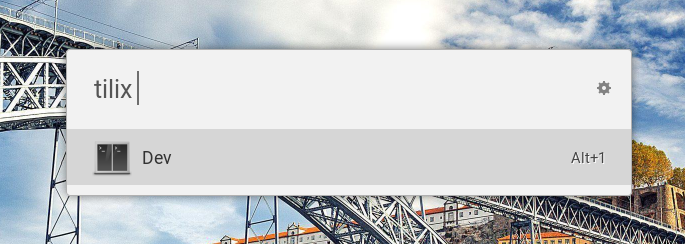

# Ulauncher Tilix Extension

[](https://ext.ulauncher.io/-/github-brpaz-ulauncher-tilix)
[](https://circleci.com/gh/brpaz/ulauncher-tilix)


> Open your saved Tilix sessions from Ulauncher

## Screenshot



[Demo](demo.gif)

## Requirements

- Ulauncher 5
- Python 3
- [Tilix terminal emulator](https://gnunn1.github.io/tilix-web/)

## Install

Open ulauncher preferences window -> extensions -> add extension and paste the following url:

```
https://github.com/brpaz/ulauncher-tilix
```

## Usage

By default, this extension looks for layout files located in "~/.config/tilix/sessions". You can change it in the extension settings.

Then, open Ulauncher and type "tilix" in the input box. A list of files on your sessions folder will be displayed. selecting one will load a new tilix session based on the save layout.

## Development

```
git clone https://github.com/brpaz/ulauncher-tilix
make link
```

The `make link` command will symlink the cloned repo into the appropriate location on the ulauncher extensions folder.

To see your changes, stop ulauncher and run it from the command line with: `ulauncher -v`.

## Contributing

Contributions, issues and Features requests are welcome.

## Show your support

<a href="https://www.buymeacoffee.com/Z1Bu6asGV" target="_blank"></a>


## License 

Copywright @ 2019 [Bruno Paz](https://github.com/brpaz)

This project is [MIT](LLICENSE) Licensed.
